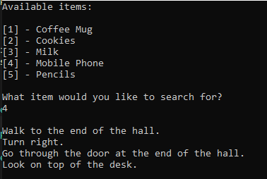

# DirectionFinder

Direction Finder is a .NET console application that reads a hierarchical list of directions and items from `Data.txt`.

The application:

- parses the direction hierarchy into a tree structure;
- validates the input data format;
- displays the available items in alphabetical order;
- lets the user select an item by its displayed number;
- prints the directions required to reach the selected item.



# Requirements

- .NET 10 SDK

# Build

Run the following command from the repository root:

```bash
dotnet build DirectionFinder/DirectionFinder.csproj
```

# Run

Run the application with:

```bash
dotnet run --project DirectionFinder/DirectionFinder.csproj
```

The application uses `DirectionFinder/Data.txt` (default) as its input file. The file is copied to the build output directory automatically.

When prompted, enter the number of the item for which directions should be displayed.

# Source Data

Example inputs are available in the `SourceData` directory:

- `SourceData/Data.small.txt`
- `SourceData/Data.medium.txt`

To use one of the example files:

1. Copy the selected file into the `DirectionFinder` directory.
2. Rename it to `Data.txt`.
3. Build and run the application again.

All `.txt` files in the project directory are copied to the build output automatically. The copy operation runs on every build so that an older `Data.txt` in `bin/Debug/net10.0` does not remain after the source file changes. If the configured filename in `SourceDataConstants` is changed, the renamed file is copied as well.

# Project Structure

- `Program.cs` contains the console application flow and output handling.
- `Parsers/` contains the input file parser.
- `Validators/` contains validation rules for the input format.
- `Models/` contains the parsed tree and node models.
- `Data.txt` contains the input direction hierarchy.
